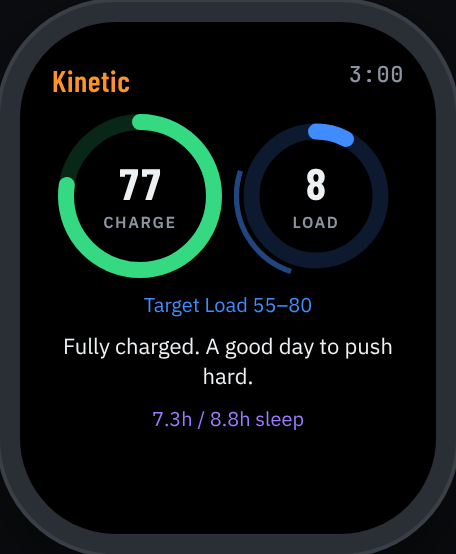
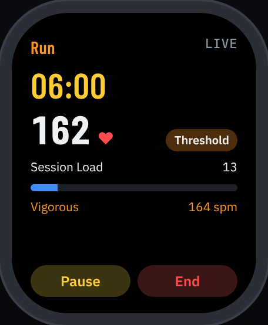
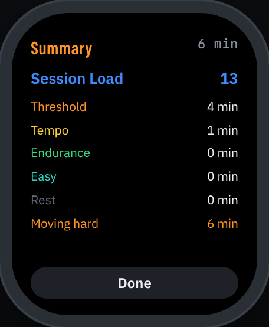
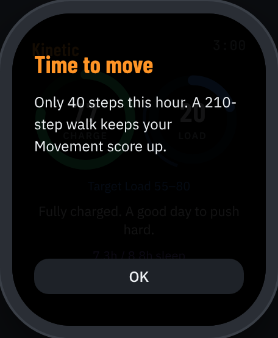
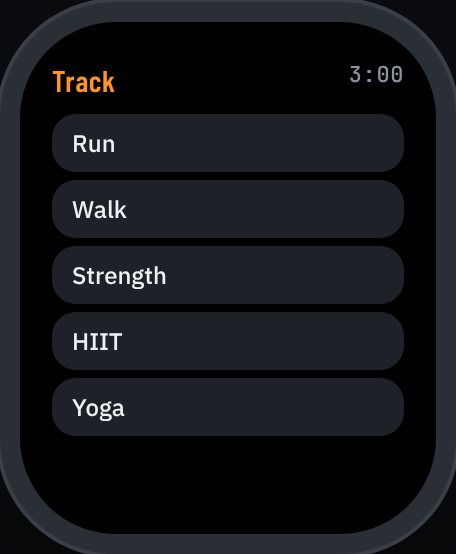
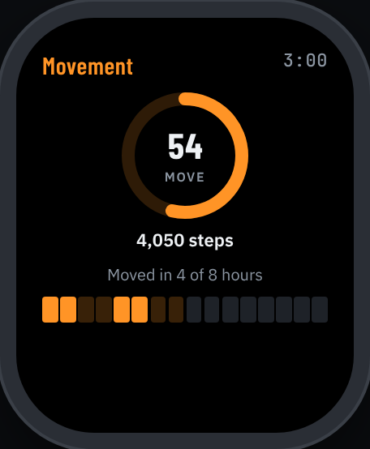
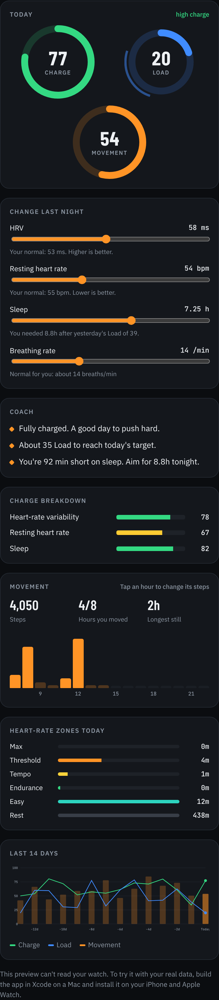

# Kinetic — a movement & recovery tracker for Apple Watch

Kinetic is a WHOOP-style app for Apple Watch and iPhone. Like WHOOP it tells you how
recovered you are and how hard you've pushed. Unlike WHOOP it also tracks **how often you
move during the day**, measures motion straight from the watch's accelerometer, and taps
your wrist when you've been still too long. No strap, no subscription. Everything runs on
your own devices from Apple Health data.

## Screenshots

These come from the interactive browser preview in `preview/index.html`, which uses sample data and the
same scoring rules as the app. Open it in any browser to try it.

| Today | Live run | Summary | Move-break nudge |
|---|---|---|---|
|  |  |  |  |

| Start a session | Movement |
|---|---|
|  |  |

**iPhone dashboard**



## The three scores

| Score | WHOOP equivalent | What it measures |
|---|---|---|
| **Charge** (0–100) | Recovery | Last night's HRV (50%), resting heart rate (20%) and sleep performance (30%), each compared with *your own* 28-day baseline. A raised breathing rate applies a penalty and a warning. |
| **Load** (0–100) | Strain (0–21) | Minutes in each heart-rate-reserve zone, weighted 1–5 (TRIMP) and mapped onto a saturating 0–100 curve. Each day gets a **target Load range** based on that day's Charge. |
| **Movement** (0–100) | *(nothing comparable)* | How evenly you moved across your waking hours: step volume vs goal (45%), share of hours with 250+ steps (35%), and a penalty for your longest sedentary stretch (20%). An hour at the gym followed by ten hours in a chair no longer looks like a perfect day. |

Sleep need adapts too: base need + half of last night's debt (capped) + up to 45 min after a
high-Load day.

## How it's different from WHOOP

- **Movement score** for all-day activity, not just cardio strain.
- **Live motion intensity** during sessions: accelerometer ENMO (still / light / moderate /
  vigorous, using published wrist cut-points) plus cadence in steps per minute, shown next to heart rate.
- **Move-break nudges**: at :50 past each waking hour the watch checks that hour's steps and
  sends a notification if you're under 250.
- **Load target, not just a score**: Charge sets a range (e.g. 55–80 when fully charged), and the
  Load ring draws that band so you can see when to stop.
- **Plain-language coach** lines instead of raw numbers.
- On-device only, uses the Apple Watch you already own.

## Project layout

```
KineticApp/
├── project.yml                  XcodeGen spec (iOS app + embedded watchOS app)
├── Packages/KineticCore/        Pure-Swift scoring engine + unit tests (no HealthKit)
│   ├── Sources/KineticCore/     Charge, Load, Sleep, Movement, Motion, ScoringEngine
│   └── Tests/KineticCoreTests/
├── Shared/                      HealthKit reader, report model, profile, shared UI
├── WatchApp/                    watchOS app: Today, live sessions, Movement, nudges
└── iOSApp/                      iPhone app: dashboard, 14-day trends, profile
```

## Running it

You need a Mac with Xcode 15 or later, an iPhone paired with your Apple Watch, and a free or
paid Apple Developer account.

1. `brew install xcodegen`
2. `cd KineticApp && xcodegen` (this creates `Kinetic.xcodeproj`)
3. Open `Kinetic.xcodeproj`. For **both** targets, open Signing & Capabilities, pick your team,
   and change the bundle IDs from `com.example.kinetic` to something you own. Keep the watch ID
   as `<phone-id>.watchkitapp`.
4. Run the **Kinetic** scheme on your iPhone. The watch app installs with it, or run the
   **KineticWatch** scheme straight onto the watch.
5. Allow Health access when asked. Charge needs about 3 nights of data before it stops
   calibrating, and it gets more accurate up to 28 days.

The scoring engine also builds and tests on its own, on macOS or Linux:

```sh
cd KineticApp/Packages/KineticCore
swift test
```

## Notes and limits

- HRV, resting HR and respiratory rate come from Apple's own background readings, so wear the
  watch to bed (with Sleep Focus / sleep tracking on) for the best Charge.
- watchOS decides when background refreshes actually run, so nudges are best-effort and
  sometimes late.
- The scores are for training guidance and are not medical advice.
